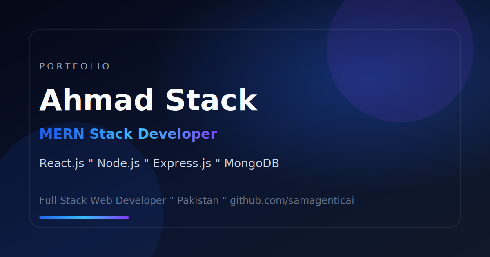

# Ahmad Stack Portfolio CMS

A production-ready **MERN Stack portfolio** with a full **content management system (CMS)**. Publish a premium developer portfolio on Vercel, manage projects, skills, profile, resume, and contact messages from a secure admin dashboard — all backed by **MongoDB Atlas**.

**Live demo:** [https://ahmadstack.dev](https://ahmadstack.dev)

---

## Features

### Public Portfolio
- Responsive premium UI with GSAP animations and magnetic interactions
- Dynamic hero, about, skills orbit, developer journey, projects gallery, and contact form
- SEO-ready: meta tags, Open Graph, Twitter cards, JSON-LD, sitemap, and robots.txt
- Resume download buttons wired to the latest PDF from the API (Navbar, Contact, Footer)
- **Ahmad Stack** branding across Navbar, Hero, Footer, and metadata

### Admin CMS (`/login` → `/admin`)
- **Projects** — CRUD, cover images, tech stack, publish/draft, display order
- **Skills** — Lucide icons, categories, proficiency, orbit animation data
- **Profile** — Hero, contact, footer, and about content
- **Resume** — Upload, replace, preview, download, delete (PDF only, max 5MB)
- **Messages** — Contact form inbox with read/unread status
- **Settings** — Change admin password

### Backend & Security
- Express 5 REST API with JWT authentication
- Helmet, rate limiting, input sanitization, CORS
- MongoDB Atlas with connection pooling and retry logic
- File uploads: local storage (dev) or **Vercel Blob** (production)
- SMTP email notifications for contact submissions

---

## Tech Stack

| Layer | Technologies |
|-------|----------------|
| **Frontend** | React 19, Vite 8, React Router 7, Tailwind CSS v4, GSAP, Framer Motion |
| **Backend** | Node.js, Express 5, Mongoose, JWT, Multer, Nodemailer |
| **Database** | MongoDB Atlas |
| **Storage** | Vercel Blob (production), local `/uploads` (development) |
| **Deployment** | Vercel (monorepo — static frontend + serverless API) |

---

## Screenshots

Add your own screenshots to [`docs/screenshots/`](docs/screenshots/) before publishing.

| Preview | Description |
|---------|-------------|
|  | Homepage / Open Graph preview |
| *Add screenshot* | Admin dashboard |
| *Add screenshot* | Projects CMS |
| *Add screenshot* | Resume management |

Recommended captures: homepage hero, projects section, admin dashboard, resume upload screen, mobile layout.

---

## Installation Guide

### Prerequisites
- **Node.js** 20+
- **MongoDB Atlas** cluster (free tier works)
- **npm**

### 1. Clone the repository

```bash
git clone https://github.com/YOUR_USERNAME/ahmad-stack-portfolio-cms.git
cd ahmad-stack-portfolio-cms
```

### 2. Install dependencies

```bash
npm install --prefix backend
npm install --prefix frontend
```

### 3. Configure environment variables

```bash
cp backend/.env.example backend/.env
cp frontend/.env.example frontend/.env
```

Edit both files with your values (see [Environment Variables](#environment-variables)).

### 4. Run locally

**Terminal 1 — API**

```bash
cd backend
npm run dev
```

**Terminal 2 — Frontend**

```bash
cd frontend
npm run dev
```

- Portfolio: [http://localhost:5173](http://localhost:5173)
- API: [http://localhost:5000](http://localhost:5000)
- Admin login: [http://localhost:5173/login](http://localhost:5173/login)

On first run, the admin account and default portfolio profile are seeded from `backend/.env`.

### 5. Production build (frontend)

```bash
npm run build --prefix frontend
```

---

## Environment Variables

### Backend (`backend/.env`)

| Variable | Required | Description |
|----------|----------|-------------|
| `MONGO_URI` | Yes | MongoDB Atlas connection string |
| `JWT_SECRET` | Yes | Secret for JWT signing (32+ characters) |
| `CLIENT_URL` | Yes | Frontend origin for CORS (e.g. `http://localhost:5173`) |
| `ADMIN_EMAIL` | Yes | Admin login email (seeded once) |
| `ADMIN_PASSWORD` | Yes | Admin password (seeded once) |
| `ADMIN_NAME` | No | Admin display name |
| `BLOB_READ_WRITE_TOKEN` | Vercel | Required for uploads on Vercel |
| `SMTP_*` | Optional | Contact form email delivery |
| `CONTACT_NOTIFY_EMAIL` | Optional | Inbox for contact notifications |

See [`backend/.env.example`](backend/.env.example) for the full list.

### Frontend (`frontend/.env`)

| Variable | Required | Description |
|----------|----------|-------------|
| `VITE_SITE_URL` | Yes | Canonical site URL (SEO, sitemap, OG tags) |
| `VITE_API_URL` | Optional | Only when API is on a separate domain |

See [`frontend/.env.example`](frontend/.env.example).

> **Never commit `.env` files.** They are listed in `.gitignore`.

---

## Deployment Guide

This project is designed as a **single Vercel project**: static frontend + `/api` serverless Express + MongoDB Atlas + Vercel Blob.

### Quick steps

1. Push this repository to GitHub (public repo: `ahmad-stack-portfolio-cms`).
2. Import the repo in [Vercel](https://vercel.com) (root directory = repository root).
3. Create a **Vercel Blob** store and add `BLOB_READ_WRITE_TOKEN`.
4. Add all environment variables from the tables above.
5. Deploy — `vercel.json` handles build, rewrites, and API routing.

### Post-deploy checklist

- [ ] `GET /api/health` returns `{ "status": "ok" }`
- [ ] Homepage loads profile and skills from API
- [ ] Admin login and CMS CRUD work
- [ ] File uploads (projects, skills, profile, resume) succeed
- [ ] Contact form saves messages and sends email
- [ ] `sitemap.xml` and meta tags are correct

Full checklist: [`DEPLOYMENT.md`](DEPLOYMENT.md)

---

## Project Structure

```
ahmad-stack-portfolio-cms/
├── api/                    # Vercel serverless entry (Express app)
├── backend/
│   ├── src/
│   │   ├── app.js          # Express application
│   │   ├── config/         # DB, env validation
│   │   ├── middleware/     # Auth, uploads, security
│   │   ├── models/         # Mongoose schemas
│   │   ├── routes/         # Public + admin API routes
│   │   └── utils/          # Storage, email, mappers, seeds
│   ├── scripts/            # Atlas & auth verification scripts
│   └── .env.example
├── frontend/
│   ├── public/             # Static assets, sitemap, robots, manifest
│   ├── scripts/            # Sitemap generator (prebuild)
│   └── src/
│       ├── components/     # UI, layout, sections, admin, SEO
│       ├── context/        # Portfolio + auth state
│       ├── hooks/          # Data fetching, animations
│       ├── pages/          # Home, Projects, Admin CMS
│       └── constants/      # SEO, navigation, forms
├── docs/screenshots/       # Add marketing screenshots here
├── DEPLOYMENT.md           # Detailed deployment checklist
├── LICENSE                 # Apache License 2.0
├── vercel.json             # Vercel build & rewrite config
└── package.json            # Root scripts
```

---

## License

This project is licensed under the **Apache License 2.0**. See the [LICENSE](LICENSE) file for the full text.

```
Copyright 2026 Syed Ahmad Mohayyudin
Licensed under the Apache License, Version 2.0
```

---

## Author

**Syed Ahmad Mohayyudin** — *Ahmad Stack*

| | |
|---|---|
| **Website** | [ahmadstack.dev](https://ahmadstack.dev) |
| **GitHub** | [@samagenticai](https://github.com/samagenticai) |
| **LinkedIn** | [Syed Ahmad Mohayyudin](https://www.linkedin.com/in/syed-ahmad-mohayyudin-bukhri-003b9b38b) |
| **Email** | syedahmadmohayyudin@gmail.com |

---

Built with the MERN stack for developers who want a portfolio that looks premium and stays easy to update.
